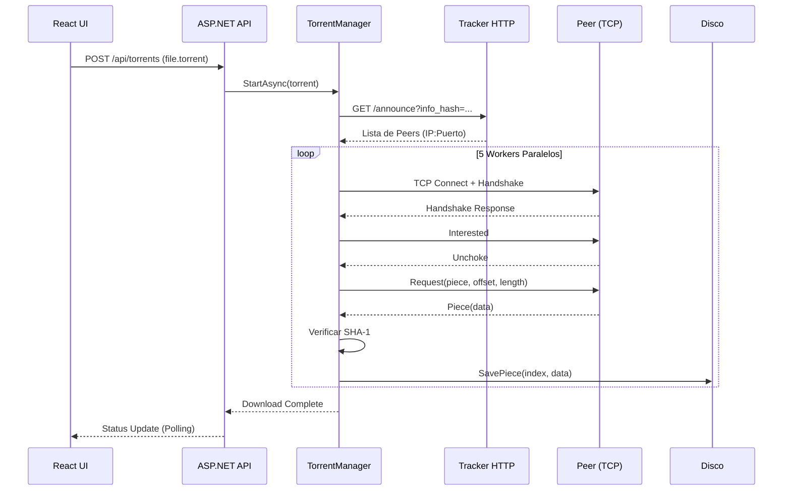

#  TorrentClient.NET


**TorrentClient.NET** es un cliente BitTorrent completo y funcional construido desde cero en **C# (.NET 8)** con una interfaz web moderna en **React**. Implementa el protocolo BitTorrent (BEP 3) con descarga concurrente, verificación de integridad SHA-1 y una arquitectura limpia y escalable.

>  ** Propósito:** Demostrar dominio de conceptos avanzados de ingeniería de software: arquitectura limpia, protocolos de red TCP/IP, concurrencia, parseo binario, y desarrollo full-stack.

---

## Tabla de Contenidos

- [Características](#-características)
- [Arquitectura](#️-arquitectura)
- [Demo](#-demo)
- [Instalación](#-instalación-y-ejecución)
- [Uso](#-uso)
- [Cómo Funciona](#-cómo-funciona-internamente)
- [Stack Tecnológico](#️-stack-tecnológico)
- [Estructura del Proyecto](#-estructura-del-proyecto)
- [Roadmap](#-roadmap-futuro)
- [Contribuir](#-contribuir)
- [Licencia](#-licencia)

---

##  Características

### Core del Protocolo BitTorrent
- ✅ **Parsing de .torrent** - Decodificación Bencode completa
- ✅ **Tracker HTTP** - Descubrimiento de peers vía HTTP/HTTPS
- ✅ **Peer Wire Protocol** - Handshake, Bitfield, Interested, Unchoke, Request, Piece
- ✅ **Verificación SHA-1** - Integridad garantizada pieza por pieza
- ✅ **Descarga multi-archivo** - Soporte para torrents con múltiples archivos

### Concurrencia y Performance
-  **Descarga paralela** - Hasta 5 peers simultáneos con worker pool
-  **Gestión de piezas** - `ConcurrentQueue` thread-safe para distribución
-  **Async/Await** - I/O no bloqueante en toda la aplicación
-  **Thread-safety** - `SemaphoreSlim` para escritura segura en disco

### Arquitectura y Diseño
-  **Clean Architecture** - Separación estricta de capas (Domain → Application → Infrastructure → Presentation)
-  **Hexagonal Pattern** - Puertos e implementaciones intercambiables
-  **Testeable** - Lógica de negocio independiente de frameworks
-  **Modular** - Componentes desacoplados y reutilizables

### Interfaz Web Moderna
-  **Dashboard React** - UI moderna con tema oscuro
-  **Progreso en tiempo real** - Actualización automática cada 2 segundos
-  **Drag & Drop** - Subida de archivos .torrent
-  **Métricas detalladas** - Piezas descargadas, velocidad, estado

---

##  Arquitectura

El proyecto implementa **Clean Architecture** con principios de **Hexagonal Architecture** (Ports & Adapters):
```
┌─────────────────────────────────────────────────────────┐
│                    PRESENTATION                         │
│  ┌──────────────┐         ┌─────────────────────────┐  │
│  │   CLI        │         │   API REST + React UI    │  │
│  └──────┬───────┘         └──────────┬──────────────┘  │
│         │                            │                  │
└─────────┼────────────────────────────┼──────────────────┘
          │                            │
┌─────────▼────────────────────────────▼──────────────────┐
│                   APPLICATION                            │
│  ┌──────────────────────────────────────────────────┐   │
│  │  TorrentManager (Orquestador de Descargas)       │   │
│  │  UseCases: DownloadPiece, DiscoverPeers         │   │
│  │  Ports: IPeerConnection, IPieceStore, ILogger    │   │
│  └──────────────────────────────────────────────────┘   │
└──────────────────────────┬──────────────────────────────┘
                           │
┌──────────────────────────▼──────────────────────────────┐
│                  INFRASTRUCTURE                          │
│  ┌──────────────────────────────────────────────────┐   │
│  │  Adapters (Implementaciones):                    │   │
│  │  • TcpPeerConnectionAdapter (Sockets)            │   │
│  │  • HttpTrackerAdapter (Tracker HTTP)             │   │
│  │  • DiskPieceStoreAdapter (FileStream)            │   │
│  │  • BencodeParserAdapter (Parsing binario)        │   │
│  └──────────────────────────────────────────────────┘   │
└──────────────────────────┬──────────────────────────────┘
                           │
┌──────────────────────────▼──────────────────────────────┐
│                      DOMAIN                              │
│  ┌──────────────────────────────────────────────────┐   │
│  │  Entities: Torrent, Peer, Piece, Handshake      │   │
│  │  ValueObjects: InfoHash, PeerId                  │   │
│  │  Enums: PeerMessageId, DownloadState            │   │
│  └──────────────────────────────────────────────────┘   │
└──────────────────────────────────────────────────────────┘
```

### Flujo de Descarga


---

##  Demo

### Logs de Consola
```bash
[INFO]  17:45:23 - Parsing: debian-12.5.0-amd64-netinst.iso.torrent
[INFO]  17:45:23 - Torrent: debian-12.5.0-amd64-netinst.iso
[INFO]  17:45:23 - Size: 660 MB
[INFO]  17:45:23 - Pieces: 2520
[INFO]  17:45:24 - Discovered 47 peers
[INFO]  17:45:24 - Starting 5 parallel workers

[91.215.85.146:6881] ✅ Piece 0 saved (1/2520)
[185.21.216.133:51413] ✅ Piece 3 saved (2/2520)
[178.128.214.209:6881] ✅ Piece 1 saved (3/2520)
...
[INFO]  18:12:47 - Download complete! 2520/2520 pieces
```

---

##  Instalación y Ejecución

### Prerrequisitos

- [.NET 10 SDK](https://dotnet.microsoft.com/download/dotnet/8.0)
- [Node.js 18+](https://nodejs.org/) (para el frontend React)
- Git

### 1. Clonar el Repositorio
```bash
git clone https://github.com/tu-usuario/TorrentClient.NET.git
cd TorrentClient.NET
```

### 2. Ejecutar el Backend (API)
```bash
cd src/TorrentClient.Presentation.API
dotnet restore
dotnet run
```

La API se ejecutará en `https://localhost:5259` (o el puerto que indique la consola).

### 3. Ejecutar el Frontend (React)

**Abrir una nueva terminal:**
```bash
cd torrent-client-ui
npm install
npm run dev
```

El frontend estará disponible en `http://localhost:5173`.

### 4. Usar la Aplicación

1. Abre el navegador en `http://localhost:5173`
2. Arrastra un archivo `.torrent` o haz clic para seleccionarlo
3. Haz clic en **"Start Download"**
4. Observa el progreso en tiempo real

---

##  Uso

### CLI (Línea de Comandos)
```bash
cd src/TorrentClient.Presentation.CLI
dotnet run -- /ruta/a/archivo.torrent
```

**Opciones:**
- Sin argumentos: Usa `test-fixtures/debian.torrent` por defecto
- Con ruta: Descarga el torrent especificado

### API REST

#### Subir y Descargar un Torrent
```bash
curl -X POST http://localhost:5259/api/torrents \
  -F "file=@debian.torrent"
```

**Respuesta:**
```json
{
  "downloadId": "a3b2c1d4-e5f6-a7b8-c9d0-e1f2a3b4c5d6",
  "message": "Download queued successfully"
}
```

#### Obtener Estado de Descarga
```bash
curl http://localhost:5259/api/torrents/a3b2c1d4-e5f6-a7b8-c9d0-e1f2a3b4c5d6
```

**Respuesta:**
```json
{
  "id": "a3b2c1d4-e5f6-a7b8-c9d0-e1f2a3b4c5d6",
  "torrentName": "debian-12.5.0-amd64-netinst.iso",
  "state": "Downloading",
  "completedPieces": 1234,
  "totalPieces": 2520,
  "percentage": 48.97,
  "totalSize": 691601408
}
```

#### Listar Todas las Descargas
```bash
curl http://localhost:5259/api/torrents
```

---

##  Cómo Funciona (Internamente)

### 1. Parsing del Archivo .torrent (Bencode)
```csharp
// BencodeDecoder lee el formato binario
var torrent = _parser.Parse("archivo.torrent");

// Resultado:
// - InfoHash: SHA-1 del diccionario 'info'
// - Announce URL: http://tracker.debian.org:6969/announce
// - Pieces: Array de hashes SHA-1 (20 bytes cada uno)
// - Piece Length: 262144 bytes (256 KB)
```

### 2. Descubrimiento de Peers (Tracker HTTP)
```csharp
// Request al tracker
GET /announce?info_hash=%a3%b2%c1...&peer_id=-TC1000-...&port=6881&uploaded=0&downloaded=0&left=660000000&compact=1

// Response (Bencode):
d8:intervali1800e5:peers300:...e  // 50 peers en formato compacto (6 bytes c/u)
```

**Formato Compacto de Peers:**
```
[IP (4 bytes)][Puerto (2 bytes BigEndian)]
[C0 A8 01 64][1A E1] → 192.168.1.100:6881
```

### 3. Handshake con Peer (TCP)
```
[1 byte: 19][19 bytes: "BitTorrent protocol"][8 bytes: reserved]
[20 bytes: InfoHash][20 bytes: PeerId]

Total: 68 bytes exactos
```

### 4. Negociación del Protocolo
```
Peer → Cliente: Bitfield (qué piezas tiene)
Cliente → Peer: Interested (me interesa descargar)
Peer → Cliente: Unchoke (podés pedirme piezas)
Cliente → Peer: Request(piece=0, offset=0, length=16384)
Peer → Cliente: Piece(piece=0, offset=0, data=[16KB])
```

### 5. Verificación de Integridad
```csharp
// Al completar una pieza (256 KB = 16 bloques de 16 KB)
var actualHash = SHA1.HashData(pieceData);
var expectedHash = torrent.Pieces.Slice(pieceIndex * 20, 20);

if (actualHash.SequenceEqual(expectedHash))
{
    await _pieceStore.SaveAsync(pieceIndex, pieceData);
}
```

### 6. Escritura en Disco (Random Access)
```csharp
// Las piezas pueden llegar desordenadas
fileStream.Seek(pieceIndex * 262144, SeekOrigin.Begin);
await fileStream.WriteAsync(pieceData);
```

---

##  Stack Tecnológico

### Backend (.NET)

| Tecnología | Uso |
|------------|-----|
| **C# 12** | Lenguaje principal |
| **.NET 10** | Runtime y framework |
| **ASP.NET Core** | Web API REST |
| **System.Net.Sockets** | Conexiones TCP de bajo nivel |
| **System.Security.Cryptography** | SHA-1 para verificación |
| **System.Threading.Channels** | Queue para background worker |
| **xUnit + Moq** | Testing unitario |

### Frontend (React)

| Tecnología | Uso |
|------------|-----|
| **React 18** | UI framework |
| **Vite** | Build tool y dev server |
| **CSS Modules** | Estilos con scope |
| **Fetch API** | Comunicación con backend |

---

##  Estructura del Proyecto
```
TorrentClient.NET/
├── src/
│   ├── TorrentClient.Domain/              # Entidades puras
│   │   ├── Entities/
│   │   │   ├── Torrent.cs
│   │   │   ├── Peer.cs
│   │   │   ├── Piece.cs
│   │   │   ├── Handshake.cs
│   │   │   ├── PeerMessage.cs
│   │   │   └── Bitfield.cs
│   │   └── ValueObjects/
│   │       ├── InfoHash.cs
│   │       └── PeerId.cs
│   │
│   ├── TorrentClient.Application/         # Lógica de aplicación
│   │   ├── Managers/
│   │   │   └── TorrentManager.cs
│   │   ├── UseCases/
│   │   │   ├── DownloadPieceUseCase.cs
│   │   │   └── DiscoverPeersUseCase.cs
│   │   └── Ports/                         # Interfaces (Hexagonal)
│   │       ├── IPeerConnection.cs
│   │       ├── IPeerDiscovery.cs
│   │       ├── IPieceStore.cs
│   │       ├── ITorrentParser.cs
│   │       └── ILogger.cs
│   │
│   ├── TorrentClient.Infrastructure/      # Implementaciones
│   │   ├── Adapters/
│   │   │   ├── TcpPeerConnectionAdapter.cs
│   │   │   ├── HttpTrackerAdapter.cs
│   │   │   ├── DiskPieceStoreAdapter.cs
│   │   │   ├── ConsoleLoggerAdapter.cs
│   │   │   └── Bencode/
│   │   │       ├── BencodeDecoder.cs
│   │   │       ├── BencodeEncoder.cs
│   │   │       └── BencodeValue.cs
│   │   └── Factories/
│   │       ├── PeerConnectionFactory.cs
│   │       └── PieceStoreFactory.cs
│   │
│   ├── TorrentClient.Presentation.CLI/    # Interfaz de consola
│   │   └── Program.cs
│   │
│   └── TorrentClient.Presentation.API/    # API REST
│       ├── Controllers/
│       │   └── TorrentsController.cs
│       ├── Services/
│       │   └── TorrentDownloadService.cs
│       ├── wwwroot/                       # Archivos estáticos
│       └── Program.cs
│
├── tests/
│   ├── TorrentClient.Domain.Tests/
│   ├── TorrentClient.Application.Tests/
│   └── TorrentClient.Infrastructure.Tests/
│
├── torrent-client-ui/                     # Frontend React
│   ├── src/
│   │   ├── components/
│   │   ├── App.jsx
│   │   └── main.jsx
│   ├── package.json
│   └── vite.config.js
│
└── README.md
```


##  Referencias y Recursos

### Documentación Oficial
- [BitTorrent Protocol Specification (BEP 3)](http://www.bittorrent.org/beps/bep_0003.html)
- [.NET Documentation](https://docs.microsoft.com/en-us/dotnet/)
- [Clean Architecture by Uncle Bob](https://blog.cleancoder.com/uncle-bob/2012/08/13/the-clean-architecture.html)

### Aprendizaje
- [Building a BitTorrent client from scratch in C#](https://allenkim67.github.io/programming/2016/05/04/how-to-make-your-own-bittorrent-client.html)
- [Understanding Clean Architecture](https://www.youtube.com/watch?v=dK4Yb6-LxAk)

---

##  Autor

**Thomas Zavalia**

- GitHub: [ThomasZavalia](https://github.com/ThomasZavalia)
- LinkedIn: [Thomas Zavalia](https://www.linkedin.com/in/thomas-zavalia/)
- Email: zavaliathomas@gmail.com

---


